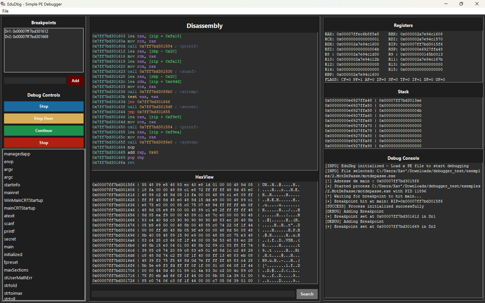

# Getting Started

Welcome to the documentation of your favorite Windows Debugger. This tool allows you to debug specific compiled executables at the instruction level using a clean and simple user interface.

> ⚠️ **Note**: This debugger is designed to work with specific compiled files. Example binaries are available on the GitHub repository for testing and demonstration purposes.

## Installation

You can clone the repository and then install dependencies :

```bash
python3 -m pip install -r requirement.txt
```

Once every packages is installed, you can launch Edudbg using this command :

```bash
python3 ./edudbg
```

Or with our CLI version :

```bash
python3 ./edudbg ./file_to_debug
```

## User Interface

The debugger interface provides the following controls:

- **Drop-down Menu (File)**: Select the executable file you want to debug.

- **Step Into Button**: Execute the program one instruction at a time.

- **Step Over Button**: Execute the instructions but doesn't enter the functions.

- **Continue Button**: Resume execution until the next breakpoint is hit.

- **Breakpoint Address Input**: Enter the memory address where you want to set a breakpoint.

- **Stop Button**: Halt the currently running program.

> 🔹 **Breakpoint Limit**: You can set a maximum of four breakpoints at a time. Trying to add more will result in an error or ignore the additional request.



## Debugging Features

The debugger offers several core features to assist with low-level program analysis:

- **Disassembly View**: Displays the disassembled machine code of the current function.

- **Stack Viewer**: Shows the current state of the call stack, helping you understand function nesting and return paths.

- **Register Viewer**: Displays live CPU register values, allowing you to trace data flow and execution logic.

- **Symbols View**: Displays symbols found inside the sections of the binary..
